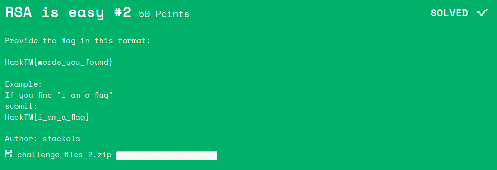

# RSA is easy #2
<p align="center">

</p>

## Walkthrough

We can notice that there is no "Public key" in the c file 
```
Public key:
[DATA CORRUPTED]
```
And we have a bunch of encrypted messages. So i went on google and looked for a way to retrieve the modulus n from ciphertexts.
I came accross this [stackexchange question](https://crypto.stackexchange.com/questions/43583/deduce-modulus-n-from-public-exponent-and-encrypted-data)
<p align="center">

</p>
Ok, so this also needs some cleartexts in order to retrive the n. Looking at the rsa.py file I noticed that the text in encrypted character by character 
```python
def enc(key, p):
    e, n = key
    cipher = [pow(ord(char), e, n) for char in p]
    return cipher
```
Interesting.

So i can figure out all the possible cleartexts which are the printable characters.

So i made this python script to retrive n.
```python
from gmpy2 import gcd
import string
ch = string.printable
c = #The ciphertexts from the file
ns=[]
e = 65537
for i in c:
	for j in c:
		for k in ch:
			for l in ch:
				if (i!=j) and (k!=l):
					g=gcd(ord(l)**e-i,ord(k)**e-j)
					if g>9999999999 and g not in ns:
						ns.append(g)
						print(g)
```
###Output 
```
53361144550014053166721365196980912889938802302767543436340298420353476899874610747222379321544658210212273658744624182437888528301817525619324262586755752560722184172889301780332276353612167586294259101340749155939404015704537471927068307582449663907783314406726655255040519664154112497941090624585931831047
```
Great! We have n now!

So it's time to decrypt the ciphertexts.

```python
from gmpy2 import gcd
import string
ch = string.printable
dic={}
cipher=[]
c = #ciphertexts from the file
n = 53361144550014053166721365196980912889938802302767543436340298420353476899874610747222379321544658210212273658744624182437888528301817525619324262586755752560722184172889301780332276353612167586294259101340749155939404015704537471927068307582449663907783314406726655255040519664154112497941090624585931831047
e = 65537

def enc(e,n, p):
    for char in p:

    	cipher.append(pow(ord(char), e, n))
    	dic[pow(ord(char), e, n)]=char
    return cipher


file = enc(e,n, ch)
f=""
for i in c:
	try:
		f+=dic[i]
	except:
		pass
print(f)
```
###Output
```
when i was in college in the early 70s, i devised what i believed was a brilliant encryption scheme. a simple pseudorandom number stream was added to the plaintext stream to create ciphertext. this would seemingly thwart any frequency analysis of the ciphertext, and would be uncrackable even to the most resourceful government intelligence agencies. i felt so smug about my achievement. years later, i discovered this same scheme in several introductory cryptography texts and tutorial papers. how nice. other cryptographers had thought of the same scheme. unfortunately, the scheme was presented as a simple homework assignment on how to use elementary cryptanalytic techniques to trivially crack it. so much for my brilliant scheme. from this humbling experience i learned how easy it is to fall into a false sense of security when devising an encryption algorithm. most people dont realize how fiendishly difficult it is to devise an encryption algorithm that can withstand a prolonged and determined attack by a resourceful opponent. here is the flag. when it comes to crypto or carpet never roll your own
```

## Flag
Hacktm{when_it_comes_to_crypto_or_carpet_never_roll_your_own}
