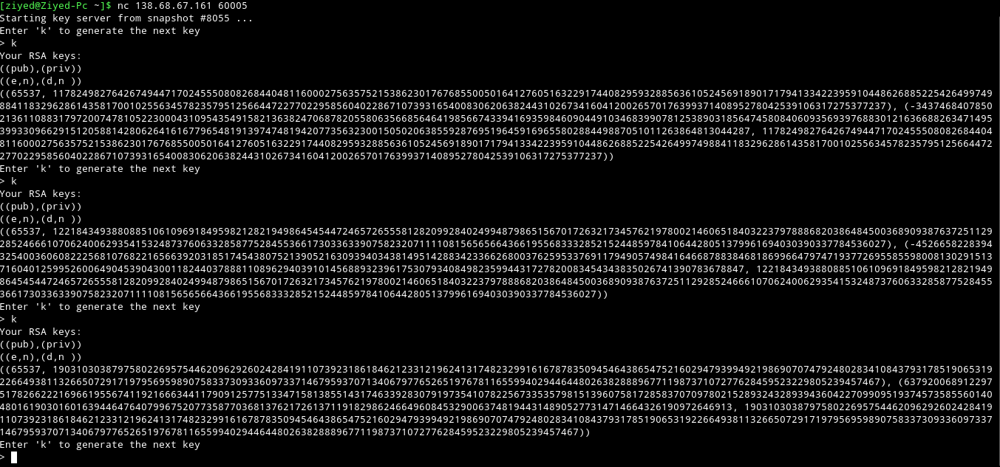

# Bad keys
<p align="center">

</p>

## Walkthrough
Checking the RSA_PUB file we can find the public key

```
(65537, 2318553827267041599931064141028026591078453523755133761420994537426231546233197332557815088229590256567177621743082082713100922775483908922217521567861530205737139513575691852244362271068595653732088709994411183164926098663772268120044065766077197167667585331637038825079142327613226776540743407081106744519)
```
The first thing I tried is to factor n using factordb, this didn't work.
I noticed that there is a snapshot that i can access via "nc 138.68.67.161 60005".
<p align="center">

</p>
So I grabbed few public and private keys and used a (script)[https://github.com/ziyedbe/ctf-writeups/blob/master/hacktm2020/badkeys/retrieve.py] i found online to factor n knowing n,e and d (As the names suggests, bad keys)

Output

```
12117717634661447128647943483912040772241097914126380240028878917605920543320951000813217299678214801720664141663955381289172887935222185768875580129866427
12117717634661447128647943483912040772241097914126380240028878917605920543320951000813217299678214801720664141663955381289172887935222185768875580129868861
12117717634661447128647943483912040772241097914126380240028878917605920543320951000813217299678214801720664141663955381289172887935222185768875580129864747
12117717634661447128647943483912040772241097914126380240028878917605920543320951000813217299678214801720664141663955381289172887935222185768875580129863163
12117717634661447128647943483912040772241097914126380240028878917605920543320951000813217299678214801720664141663955381289172887935222185768875580129864081
12117717634661447128647943483912040772241097914126380240028878917605920543320951000813217299678214801720664141663955381289172887935222185768875580129864747
12117717634661447128647943483912040772241097914126380240028878917605920543320951000813217299678214801720664141663955381289172887935222185768875580129864949
12117717634661447128647943483912040772241097914126380240028878917605920543320951000813217299678214801720664141663955381289172887935222185768875580129865231
12117717634661447128647943483912040772241097914126380240028878917605920543320951000813217299678214801720664141663955381289172887935222185768875580129865389
12117717634661447128647943483912040772241097914126380240028878917605920543320951000813217299678214801720664141663955381289172887935222185768875580129864747
12117717634661447128647943483912040772241097914126380240028878917605920543320951000813217299678214801720664141663955381289172887935222185768875580129864949
```
We can notice that all the primes are almost the same except the few last 4 digits. 
I went and tried to bruteforce the last 4 digits and try to factor n using it but this didn't work. 
I went for few more digits and finally was able to factor n.
```python
p = 12117717634661447128647943483912040772241097914126380240028878917605920543320951000813217299678214801720664141663955381289172887935222185768875580120000000

n = 2318553827267041599931064141028026591078453523755133761420994537426231546233197332557815088229590256567177621743082082713100922775483908922217521567861530205737139513575691852244362271068595653732088709994411183164926098663772268120044065766077197167667585331637038825079142327613226776540743407081106744519
for i in range(p,p+10000000):
	if n%i==0:
		print(i)
```
output
```
12117717634661447128647943483912040772241097914126380240028878917605920543320951000813217299678214801720664141663955381289172887935222185768875580128178823
```
Great, we have one prime now computing the other prime is trivial.

```
q = 191335851945837067856377662680848400296318974773300853031596930993909166558084000989878627579396244459141148723017644937657511582545081598962216442940353
phi = (p-1)*(q-1)=2318553827267041599931064141028026591078453523755133761420994537426231546233197332557815088229590256567177621743082082713100922775483908922217521567861517896683652906291495347923215678179423116315199810313318122689077498834062389085042262670149939556621405526346651852052915497213709009273375569284535625344
d = invmod(e,phi)=2043314668072425068087011483488040829163956851420194098881431580605258944043681864237632574742152439821024427407650515758435235008371212103399871724292806951168923522722704683003512030221232905519279116289520649589591362133740351349387154813919618825576125226745251858019443068382321303211961987200618339457
m = pow(c,d,n)=12248962771073894677473096770410518677529479722271545867643215541833498128196304035177125060226895164008611486959227790433532029
```

## Flag
HackTM{SanTa_ple@s3_TakE_mE_0ff_yOur_l1st_4f2d20ec18}
